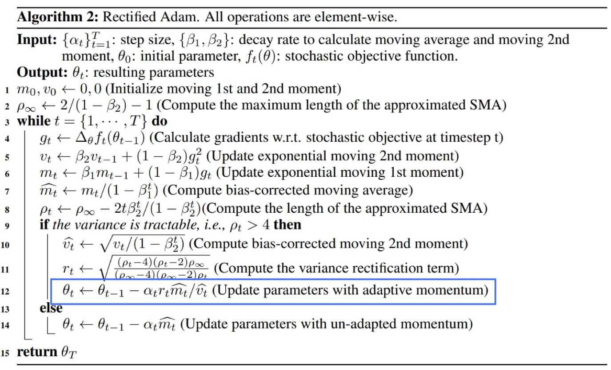
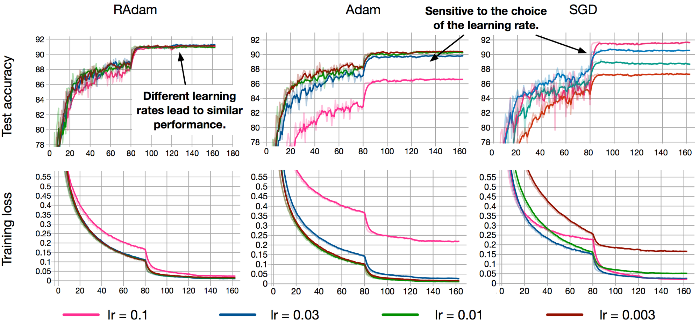

<h1 align="center">RAdam-Tensorflow</h1>
<h4 align="center">On the Variance of the Adaptive Learning Rate and Beyond</h5>

### [Paper](https://arxiv.org/abs/1908.03265) | [Official Pytorch code](https://github.com/LiyuanLucasLiu/RAdam)

## Usage
```python
from RAdam import RAdamOptimizer

train_op = RAdamOptimizer(learning_rate=0.001, beta1=0.9, beta2=0.999, weight_decay=0.0).minimize(loss)
```

## Algorithm
<div align="center">
  
</div>


## Result


## Author
[Junho Kim](http://bit.ly/jhkim_ai)
